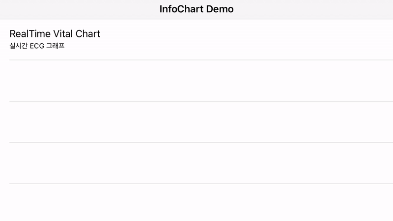

# InfoCharts-iOS

`InfoCharts`는 **InfoMining Co., Ltd**의 앱에 사용될 `자체 제작 차트 라이브러리` 입니다.

Android 버전의 라이브러리를 사용하고자 한다면, [여기](https://github.com/infodevelop/AndroidInfoChart)를 눌러주십시오.


# 1. Setting

1. `InfoChart.xcodeproj`를 사용할 프로젝트로 드래그
2. `target` > `general` > `Frameworks, Libraries, and Embedded Content`에 InfoChart.framework를 추가
3. `import InfoChart`


# 2. Charts

## 2-1. RealTimeVitalChart



ECG, PPG 등의 `실시간 생체 신호`를 표시해주는 차트입니다.

실제 의료기기에서 표시되는 동일한 애니메이션이 지원됩니다.


### 1) How To Use?

1. RealTimeVitalChartView를 생성한 후 outlet으로 연결합니다.

    ```swift
    @IBOutlet var chartView: RealTimeVitalChartView!
    ```

2. **실시간 출력에 대한 스펙**을 설정합니다.

    ```swift
    let spec = Spec(oneSecondDataCount: 500,
                    visibleSecondRange: 5,
                    refreshGraphInterval: 0.1,
                    vitalMaxValue: 1.5,
                    vitalMinValue: -0.5)
                    
    chartView.setRealTimeSpec(spec: spec)
    ```

    **※ Spec Class**

    ```
    1. oneSecondDataCount: 1초 동안 들어오는 데이터 개수
    2. visibleSecondRange: 보여질 시간(초 단위)
    3. refreshGraphInterval: 새로고침 되는 그래프와 이전 그래프와의 간격
    4. vitalMaxValue: 바이탈 최대 값
    5. vitalMinValue: 바이탈 최소 값
    ```

3. 차트에 표시하고자 하는 **실시간 데이터**를 `DataHandler`에 넣어줍니다. 데이터를 넣으면, 차트 애니메이션이 시작되면서 **실시간 차트가 표시**됩니다.

    ```swift
    chartView.dataHandler.enqueue(value)
    ```

4. 차트가 그려진 view의 **생명주기가 끝나거나**, 더 이상 **차트를 표시할 일이 없다**면 **차트의 스케쥴러를 비활성화합니다.**

    ```swift
    chartView.dataHandler.stop()
    ```


### 2) Details

1. **차트 설정 관련**
   
    - `setRealTimeSpec(Spec)` : 실시간 차트의 스펙을 설정
    - `reset()` : 차트를 리셋합니다. 그려진 데이터와 아직 출력되지 않은 데이터를 초기화 하고 애니메이션을 중단
    - `lineColor: UIColor` : 그래프의 색
    - `lineWidth: CGFloat` : 그래프의 두께
    - `isEnabledValueCircleIndicator: Bool` : 가장 마지막으로 그려진 값을 표시하는 인디케이터 활성 여부
    - `valueCircleIndicatorRadius: Double` : 가장 마지막으로 그려진 값을 표시하는 인디케이터의 크기
    - `valueCircleIndicatorColor: UIColor` : 가장 마지막으로 그려진 값을 표시하는 인디케이터의 색상
2. **데이터 관련**
    - `dataHandler` : 균일하지 못하거나 무작위로 들어오는 데이터로 인한 위상 지연 현상 등을 해결하기 위해 데이터를 관리하는 실시간 데이터 핸들러
    - `dataHandler.enqueue(value)` : 핸들러에 출력할 데이터를 추가합니다. 차트가 정지되어 있다면 데이터를 출력하는 동작도 함께 실행됩니다.
    - `dataHandler.run()` : 실시간 데이터를 차트에 출력합니다. 핸들러에 출력할 데이터가 남아있다면 해당 데이터들을 순차적으로 차트에 출력하고, 없다면 기본값이 출력됩니다.
    - `dataHandler.stop()` : 차트에 실시간 데이터 출력을 정지합니다.
    - `dataHandler.reset()` : 핸들러에 있는 데이터를 초기화 합니다. 실시간 데이터 출력에 영향을 미치지 않습니다.
    
    

# 3. Documentaion

- SDK에 대한 상세한 정보는 여기 문서를 통해 확인하실 수 있습니다.
